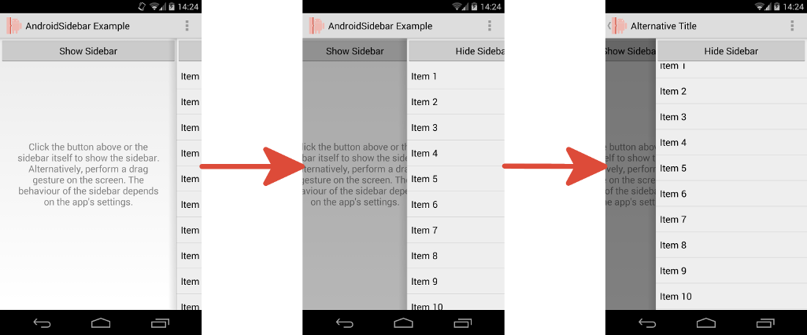

# AndroidSidebar - README

[](https://android-arsenal.com/api?level=14) [](https://opensource.org/licenses/Apache-2.0) [](https://www.paypal.com/cgi-bin/webscr?cmd=_s-xclick&hosted_button_id=X75YSLEJV3DWE)

"AndroidSidebar" is an Android-library, which provides a custom view implementation, which allows to show a sidebar, which overlaps the view's main content and can be shown or hidden in an animated manner. The sidebar may be located at the left or right edge of the parent view and its state can be changed by either calling methods or by dragging on the device's touch screen. Furthermore, there are a lot of attributes, which allow to specify the appearance and behavior of the sidebar.



The library provides the following features:

- The sidebar can be located at left or right edge of its parent view.
- The width of the sidebar can be set relatively to the width of its parent view. Additionally, a maximum width can be defined.
- It is possible to specify an offset, which defines the amount of space the sidebar is visible even if it currently hidden. The offset can be set relatively to the width of the parent view and a maximum value can be defined.
- The way, the main content is animated, when the sidebar becomes shown or hidden, can be adjusted in many ways, including the possibility to move it or to resize it.
- The sidebar's state can be changed via drag gestures or by clicking the touch screen of the device. For each possibility multiple settings exist, e.g. it is possible to change the sensibility for recognizing drag gestures.
- The speed of the animation, which is used to show or hide the sidebar, can be chosen freely.
- The sidebar allows to specify an elevation, which causes a shadow to be rendered in front of the main content.
- It is possible to fade in a semi-transparent overlay, which is shown in front of the main content, when the sidebar becomes shown. The transparency and color of the overlay can be adjusted.

## License Agreement

This project is distributed under the Apache License version 2.0. For further information about this license agreement's content please refer to its full version, which is available at http://www.apache.org/licenses/LICENSE-2.0.txt.

Prior to version 2.1.4 this library was distributed under the GNU Lesser General Public License version 3.0 (GLPLv3).

## Download

The latest release of this library can be downloaded as a zip archive from the download section of the project's Github page, which is available [here](https://github.com/michael-rapp/AndroidSidebar/releases). Furthermore, the library's source code is available as a Git repository, which can be cloned using the URL https://github.com/michael-rapp/AndroidSidebar.git.

Alternatively, the library can be added to your Android app as a Gradle dependency by adding the following to the respective module's `build.gradle` file:

```groovy
dependencies {
    compile 'com.github.michael-rapp:android-sidebar:2.1.10'
}
```

Before version 2.0.0 this project was hosted on [Sourceforge](https://sourceforge.net/projects/androidsidebar). These older versions used the legacy Eclipse ADT folder structure and are not available as Gradle artifacts.

## Examples

The code below shows how to declare the view, which is provided by this library within a XML layout resource. This project also contains a more detailed documentation in the Wiki as well as generated Javadoc files.

```xml
<?xml version="1.0" encoding="utf-8"?> 
<de.mrapp.android.sidebar.Sidebar xmlns:android="http://schemas.android.com/apk/res/android" 
    xmlns:custom="http://schemas.android.com/apk/res-auto"
    android:layout_width="match_parent" 
    android:layout_height="match_parent" 
    android:animationSpeed="1.0" 
    android:contentMode="scroll" 
    android:contentOverlayColor="@android:color/black" 
    android:contentOverlayTransparency="25%" 
    android:contentView="@layout/content_view" 
    android:dragModeWhenHidden="both" 
    android:dragModeWhenShown="disabled" 
    android:dragSensitivity="100%" 
    android:dragThreshold="10%" 
    android:hideOnBackButton="false" 
    android:hideOnContentClick="false" 
    android:location="left" 
    android:maxSidebarOffset="100dp" 
    android:maxSidebarWidth="600dp" 
    android:scrollRatio="100%" 
    android:sidebarElevation="8dp" 
    android:showOnSidebarClick="true" 
    android:showSidebar="true" 
    android:sidebarBackground="@drawable/sidebar_background_left_dark" 
    android:sidebarOffset="10%" 
    android:sidebarView="@layout/sidebar_view" 
    android:sidebarWidth="50%" />
```

## Contact information

For personal feedback or questions feel free to contact me via the mail address, which is mentioned on my [Github profile](https://github.com/michael-rapp). If you have found any bugs or want to post a feature request please use the [bugtracker](https://github.com/michael-rapp/AndroidMaterialViews/issues) to report them.
